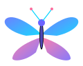

# 🦋 Browserfly

<p align="center">
  
</p>

<p align="center">
  
  
  
  
</p>
<p align="center">
  
  
  
  
  
</p>

---

> **English:** Your AI agent lives in the browser. Local. Private. Yours.

> **Français :** Votre agent IA vit dans le navigateur. Local. Privé. À vous.

---

## ✨ Features

- **8 Cloud AI Providers** — Groq, Kimi, OpenAI, Anthropic, Google Gemini, Mistral, Together AI, Cohere
- **Live model fetching** — browse available models per provider with your API key
- **HuggingFace browser** — search & discover local models with RAM requirements
- **GravitationalMemory** — quantum-orbital-inspired RAG memory system
- **Web Workers** — parallel task routing + inference engine
- **CapabilityMap** — agent is self-aware of what it can/cannot do at runtime
- **Browser Self-Tests** — 28+ tests run automatically on startup
- **Activity Logger** — full trace with CSV export
- **Soul File** — define your agent's personality as JSON
- **Task Router** — auto-route to local or cloud based on complexity, privacy, urgency
- **Bilingual** — full EN/FR i18n
- **Zero build step** — one HTML file, open in browser

## 🚀 Quick Start

```bash
git clone https://github.com/tryboy869/browserfly.git
cd browserfly
open index.html   # or just double-click it
```

That's it. No npm install. No build step.

## 📦 Project Structure

```
browserfly/
├── index.html          ← Everything lives here
├── assets/
│   ├── logo.svg        ← Animated butterfly logo
│   └── author-card.svg ← Animated author card
└── README.md
```

## 🔌 Supported Providers

| Provider | Live Fetch | Default Models |
|---|---|---|
| Groq | ✅ | — |
| Moonshot/Kimi | — | ✅ 6 models |
| OpenAI | ✅ | — |
| Anthropic | — | ✅ 3 models |
| Google Gemini | ✅ | — |
| Mistral | ✅ | — |
| Together AI | ✅ | — |
| Cohere | ✅ | — |

## 🧪 Self-Tests

Browserfly runs **28+ tests automatically** every time you open `index.html`:

- Browser API availability (IndexedDB, Fetch, Workers, WebGPU, Bluetooth…)
- App internals (ConfigManager, Logger, GravitationalMemory, GBit orbital states)
- Task Router logic (privacy routing, complexity routing, urgency routing)
- i18n completeness (EN + FR)

Results are visible in the **Self-Tests** tab.

## 🧠 Architecture

```
index.html
├── ConfigManager    → IndexedDB persistence
├── Logger           → Activity trace (10,000 entries)
├── GravitationalMemory → RAG using quantum orbital states (n/l/m)
│   └── GBit         → 680 orbital state encoding
├── WorkerMgr        → 2 Web Workers (TaskRouter + InferenceEngine)
├── CapabilityMap    → Runtime self-awareness of available APIs/features
└── BrowserSelfTest  → 28+ auto-tests on startup
```

## 👤 Author

<p align="center">
  
</p>

## 📄 License

MIT — © 2026 Daouda Abdoul Anzize (Nexus Studio)
